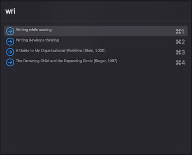

# hammerspoon-bear

A Spoon (module) for using [Hammerspoon](https://www.hammerspoon.org)
to enhancle the functionality of [Bear.app](https://bear.app/).

## Introduction

This "Bear.spoon" module for Hammerspoon provides a number of functions to
enhance the functionality of [Bear.app](https://bear.app/).

1. An API for accessing, modifying, and createing Bear notes.
2. A templating system for creating new notes based on other Bear notes which
   are treated as templates.
3. A Daily Journal system for creating and managing a the concept of a "Daily"
   note.
4. A backlinks processing system, for automatically inserting so-called
   "backlinks" into notes.
5. A quick open popup with fuzzy completion for jumping to a specific note or
   #tag.

Each of these features is explained below.

## Demo

Here's a brief video demonstrating some of the features:

[](https://www.youtube.com/watch?v=Hg0oS2m4czY)

## Installation

To install this Spoon, either clone this repository to your
`~/.hammerspoon/Spoons/` directory as "Bear.spoon" or download the latest release
[zip file](https://github.com/dcreemer/hammerspoon-bear/releases) and extract
the contents to that directory (renaming the directory to "Bear.spoon").

```sh
$ cd ~/.hammerpoon/Spoons/
$ git clone https://github.com/dcreemer/hammerspoon-bear.git Bear.spoon
```

## Configuration

Load the spoon in your Hammerspoon config file, and initialize it with your [Bear
API token](https://bear.app/faq/X-callback-url%20Scheme%20documentation/#token-generation):

```lua
bear = require("Bear")
-- bear.init(bearToken)
bear.init() -- if not provided, it will be read from the configuration note.
```

In the previous example, the token is read from a configuration note. This is a
special note always titled `Hammerspoon-Bear Configuration`, which should
consist of one Lua code block (everything else is ignored). In that code block,
assign to the `bearToken` variable the Bear API token you obtained from Bear.

```md
# Hammerspoon-Bear Configuration

This note is read by the Bear.spoon. Pleasebe careful when editing it.

    ```lua
    -- The bear API token. Alternatively can be specified in the
    -- spoon init() function.
    bearToken = "32E49A-1A174E-63CABB"
    ```
Anything outside of the code block is ignored.
```

We'll come back to the configuration note later when discussing the Daily
Journal.

## API

The API exposed in this Spoon provides read, write, search, and some tag
functions. The Read and Search APIs come in two flavors: x-callback and DB. The
x-callback API uses the
[x-callback-url](https://bear.app/faq/X-callback-url%20Scheme%20documentation/)
provided by Bear. This API is accessed via executing an `xcall` command as a
separate process. The `xcall` command handles the request and response to Bear,
and then returns data to the API. See the
[xcall](https://github.com/dcreemer/hammerspoon-bear/blob/main/xcall.lua) Lua
driver for more information.

Since the `xcall`-based API can be slow, and also drives the Bear UI, this
project also uses direct reading of the Bear database for read-only functions.
Reading and searching for notes viq the database-based API is *much* faster than
the `xcall` API, and enabled building features like the note chooser (see
below).

## Templates

In addition to implementing the Bear API, this module also implements a simple
templating system, using the "etlua" template engine
(https://github.com/leafo/etlua). To use the templates, just create a Bear note
that containes template text, and then call the `createFromTemplate` method.
(You likely want to bind this to a hotkey). The template text can access
any Hammerspoon / Lua function -- so be careful.

For example, if your note looks like this:

```
# A simple bear note template <%= math.random() %>

Today is <%= os.date("%A, %B %d, %Y") %>. Have a nice day.
```

When you call `newFromCurrentTemplate` the new note will look something like:

```
# A simple bear note template 0.95126520403693

Today is Monday, December 31, 2021. Have a nice day.
```
(the random number is generated by the `math.random` function to provide a
unique title for each invocation).

See the [etlua](https://github.com/leafo/etlua) documentation for more details about the templating language, but it's essentially just this:
`<% [any Lua statement] %>` or `<%= [any Lua expression] %>`.

The template is evaluated with access to additional symbols defined in the
`template_env` table. Some convenience functions are pre-defined:

* `today({optional numeric datetime})`: returns the start of the day as a date table.
* `yesterday({optional numeric datetime})`: returns the start of the day before the current day as a date table.
* `tomorrow({optional numeric datetime})`: returns the start of the day after the current day as a date table.
* `date({optional date table})`: returns a nicely formatted date string like "January 1, 1970".
* `isodate({optional date table})`: returns an ISO date string like "1970-01-01".
* `link(id, title)`: returns a Bear x-callback-url link to the note with the given or title (one must be nil).
* `tag(txt)`: returns a string of "#" + txt.

The `today()`, `yesterday()`, and `tomorrow()` functions can date a numeric datetime, or nil to use the current time.

If a Lua code block is in a template note, and the first line is `-- BEAR_TEMPLATE
`, then that code block is executed but not included in the final note.

```
# Another template
    ```lua
    -- BEAR_TEMPLATE
    dow = os.date("%A! %A! %A!")
    ```
I don’t like: /<%= dow %>/ !

Today is <%= date(today()) %>, and yesterday was <%= date(yesterday()) %>.
```
gives:
```
# Another template
I don't like Monday! Monday! Monday!

Today is December 31, 2021, and yesterday was December 30, 2021.
```

See the 
[source](https://github.com/dcreemer/hammerspoon-bear/blob/main/init.lua) for
details.

## Daily Journal

The API and template features are combined to create a Daily Journal system. The
Daily Journal system enables you to easily create and navigate to a unique note
per-day. When you hit the hotkey assigned to go to "today's" note, the note for
today is either created from a journal template note, or opened if it already
exists. To use the Daily Journal, you need to create a journal template note,
and define a function that takes a date table as an argument, and returns the
title of the note to use for that date. Both of these tasks are done in the
configuration note descibe above. Here's an example:

```md
# Hammerspoon-Bear Configuration

This note is read by the Bear.spoon. Pleasebe careful when editing it.

    ```lua
    -- The bear API token. Alternatively can be specified in the
    -- spoon init() function.
    bearToken = "32E49A-1A174E-63CABB"

    -- the Bear note ID of the daily journal template note:
    journalTemplateId = "9DF38853-AF0D-418C-98D5-67D4DDC8125F-19658-00000050E2567000"

    -- a function which takes a date, and returns a string of
    -- the title of a daily journal note:
    function journalTitle(date)
        return "Journal for " .. os.date("%b %d, %Y", date)
    end
    ```
Anything outside of the code block is ignored.
```

The specific names `journalTemplateId` and `journalTitle` are important. Creat a
templated note with the ID `journalTemplateId`, and fill it with at least a
title that matches the function `journalTitle`. Example:

```
# <%= journalTitle(journalDate) %>
    ```lua
    -- BEAR_TEMPLATE
    -- when dealing with Journal templates, the variable
    -- "journalDate" is always set to the current day
    -- previous day
    p = isodate(yesterday(journalDate))
    -- next day
    n = isodate(tomorrow(journalDate))
    -- the day of the week -- like "Monday"
    dow = os.date("%A", journalDate)
    -- I like to tag my journal entries like this:
    tag = "#journal/" .. os.date("%Y/%m-%B", journalDate)
    ```
<- [<%= p %>](<%- "hammerspoon://bear?cmd=journal-goto&date=" .. p %>)                   **<%= dow %>**                   [<%= n %>](<%- "hammerspoon://bear?cmd=journal-goto&date=" .. n %>) ->

## Notes

---
<%= tag %>
<% -- #~templates %>
```
There are several things to point out about this note template. First the
variable `journalDate` is always set to the current day, ready to be used in the
various date functions.

Second, the variable `tag` is set to the tag and then evaluated in a `<%= ...
%>` block -- this puts the tag in the created note, but *not* in the original
note. The comment block following -- `<% -- #~templates %>` sets the tag for the
template, but *not* for the created note.

Finally, note the use of the `hammerspoon://bear?cmd=...` link. This is a link
back into the Bear spoon, and is used to trigger the various commands that the
intergration can handle. Right now the only command is `journal-goto`, which
uses the `journalTitle` function to determine the title of the note to open and
then jumps to that date (possibly creating the note).

Bind a key to the spoon's `openJournalToday` method, and then hit the key to go
to (or create) the journal for today. In addition, you can bind a key to the
`openJournalAtDate` method, and then hit the key to go to (or create) the
journal for the date you specify.

## Backlinks

(The backlinks feature is a more-or-less direct port of the algorithm used by the [bear-backlinks](https://github.com/cdzombak/bear-backlinks) Python script)

Since we have access to the content of all notes, and can use the search
functionality of Bear, we can build a system that searches for all inbound links
to a note, and then tabulates those links at the end of the target note. These
inbound links are usually called **backlinks**, and are one of the nice features
of Obsidian and other note taking systems. 

To have a note gain a backlinks list, add a section like this, usually to the
end of any note:
```md
## Backlinks
---
```

Map a hotkey to the `updateBacklinks` function, and run it. This will update all notes with `## Backlinks` sections. For example, you might see something like this added:

```md
## Backlinks
* [[Music Player]]
* [[Journal for April 07, 2021]]
* [[Journal for April 06, 2021]]
* [[Journal for April 08, 2021]]
* [[Journal for Apr 15, 2021]]
* [[Journal for Apr 14, 2021]]
---
```

## Popup note chooser

Finally, there is a popup note chooser. This is a feature that allows you to
open any note or tag based on "fuzzy" text searching. Bind a key to
`noteChooser` function, and then hit the key to open the chooser. It will look
something like this:



## Example

For an example of how to use this module in your own Hammerspoon configuraiton,
see my [personal .hammerspoon](https://github.com/dcreemer/dotfiles/tree/main/dot_hammerspoon) directory.

---
Copyright (c) 2022 D. Creemer. MIT License.

Some original code, and many bits and pieces of code adapted from these
projects. I am very greatful to the authors for sharing their code.

* https://github.com/leafo/etlua
* https://github.com/cdzombak/bear-backlinks
* https://github.com/martinfinke/xcall
